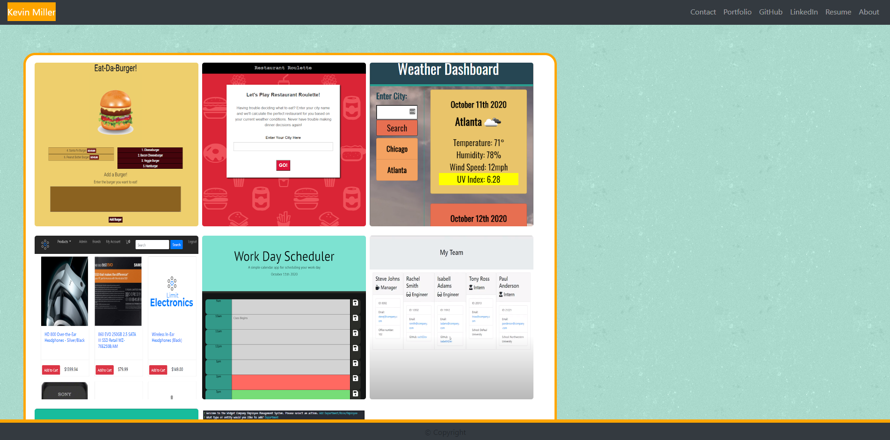

  # React-Portfolio

  

  ## Description
  A React application to display some quick information about myself along with my resume, LinkedIn profile, and GitHub repositories. 

  ## Table of Contents
  * [Installation](#installation)
  * [Usage](#usage)
  * [Contributing](#contributing)
  * [Tests](#tests)
  * [Questions](#questions)

  ## Installation 
    
  *Steps required to install package:* 
    
  Once you have cloned down the repo to your local machine, navigate to the server.js file in your terminal, then type `npm i`. This will install all necessary dependencies for both the client and server side. Once complete, you may use `npm start` to run the application.

  ## Usage

  *Examples of project use:*

  [https://protected-fortress-86982.herokuapp.com/](https://protected-fortress-86982.herokuapp.com/)

  

  ## Contributing

  *If you are interested in contributing to this project, please follow the below instructions:*

  Pull requests not welcome at this time. 

  ## Tests

  *Application tests and instructions for them:*

  N/A

  ## License

  None
  

  ## Questions

  *If you have any questions regarding this application, please utilize the below contact information:*

  [kmiller343@gmail.com](mailto:kmiller343@gmail.com)
  
  [GitHub Profile](https://www.github.com/k1te-m)
  
